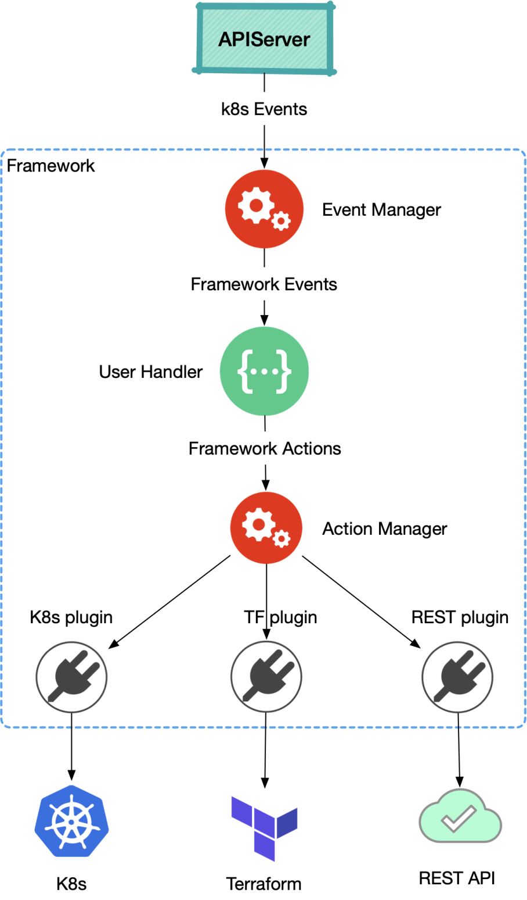

# OAM Runtime SDK

**NOTE: This SDK only support v0.1.x release of OAM specification (v1alpha1). For v0.2.x release (v1alpha2) please check Crossplane's [OAM Kubernetes Runtime](https://github.com/crossplane/oam-kubernetes-runtime) as dependency. We are also planning to publish a lib/sdk for implementing Trait in the future.**

The OAM Runtime SDK Project is a collection of go libraries and utility tools for building OAM runtime. With the SDK, we want to streamline and simplify building OAM runtime by achieving:

- Building new and converting to OAM API types easily.
- Reducing duplicate coding work via generating code scallfold and importing go library.
- Hiding low level details like k8s informer and providing high level abstraction to simplify user implementation.


## Concepts

The SDK has the following major concepts that simplifies writing OAM code:

- **Handler**: A handler is an interface that must be user-implemented. 
               The inputs and outputs are high level abstractions of events and actions.
- **Event**: An event is an encapsulation of change that triggers user handler.
             It could be events of k8s or other platforms (e.g. cloud MQ).
- **Action**: An action is an abstraction of declarative description of platform dependent operations.
              It separates concerns of high level user intention and low level platform details (e.g. client-go).
			  In this way we have a modular system that provides reusable and pluggable actions.

The following diagram shows how they work together:



For more concepts in this SDK, please refer to [concepts.md](./doc/concepts.md).

## Getting started

There is an example implementation of OAM runtime using SDK in _pkg/example/framework/main.go_. We recommend reading the code as a starting point.

We could run the code and deploy OAM app by running following commands:


```shell
# turn on go module
export GO111MODULE=on

# install oam crds
make install

# run example
go run pkg/examples/framework/main.go

# deploy OAM component
kubectl apply -f examples/componentschematics.yaml

# deploy OAM app
kubectl apply -f examples/app.yaml
```

This example will create a deployment as `Server` workload.

There is another example which will show you how to build more extensions. Read the [doc](pkg/examples/extendworkload/README.md) for more details.

## Misc.

oam-runtime contains many utilities to help you implement oam runtime easier:

* finalizer

* status check

* spec equal check
